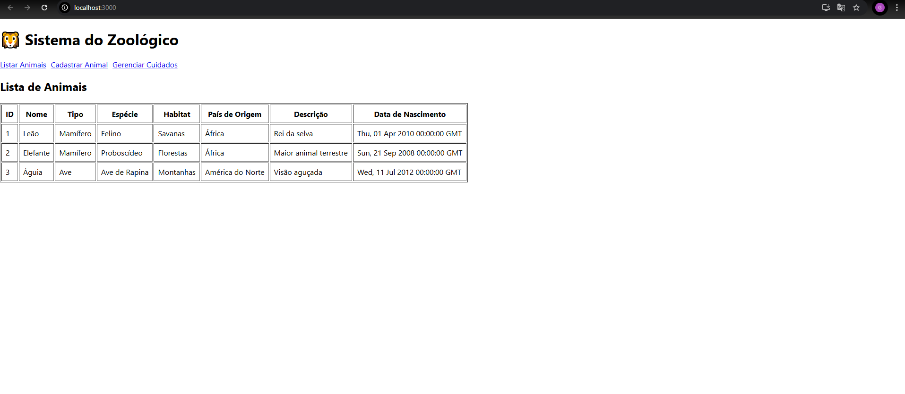
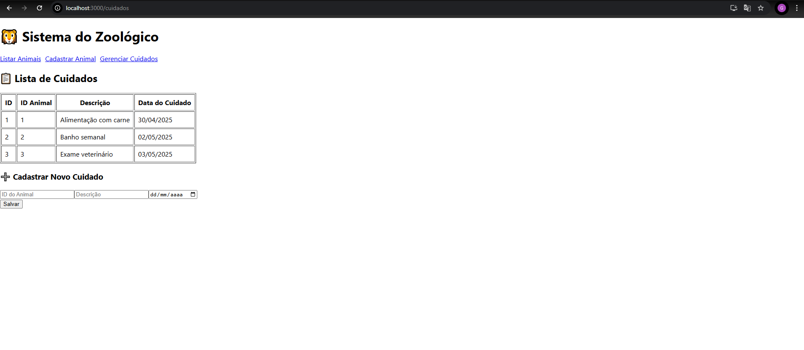

# Sistema de Gerenciamento de Zoológico

Este projeto foi desenvolvido como parte do teste prático para a vaga de estágio no CIEE/PR.  
O sistema tem como objetivo permitir o cadastro, listagem e gerenciamento de animais e cuidados veterinários de forma simples e funcional, utilizando tecnologias modernas de desenvolvimento web.

## Funcionalidades

**Animais**
- Listar animais cadastrados
- Cadastrar novo animal
- Atualizar informações
- Remover registros

**Cuidados**
- Listar cuidados aplicados aos animais
- Cadastrar novo cuidado (alimentação, banho, exames, etc.)

## Tecnologias Utilizadas

**Frontend**
- React.js
- React Router DOM
- Fetch API

**Backend**
- Python
- Flask
- Flask-CORS
- MySQL Connector

**Banco de Dados**
- MySQL 8.0

## Estrutura do Projeto

```
zoologico-projeto/
├── backend/
│   ├── app.py
│   ├── routes.py
│   ├── models.py
│   ├── database.py
│   └── zoologico.sql
├── frontend/
│   └── src/
│       ├── App.js
│       └── components/
│           ├── AnimalList.js
│           ├── CadastroAnimal.js
│           └── Cuidados.js
├── screenshots/
│   ├── lista-animais.png
│   └── cuidados.png
└── README.md
```

## Como executar o projeto localmente

### 1. Clonar o repositório

```bash
git clone https://github.com/gustavotab/zoologico-projeto.git
cd zoologico-projeto
```

### 2. Configurar o banco de dados

Crie o banco e execute os comandos abaixo no MySQL:

```sql
CREATE DATABASE zoologico;

CREATE TABLE IF NOT EXISTS animais (
    id INT AUTO_INCREMENT PRIMARY KEY,
    nome VARCHAR(100) NOT NULL,
    tipo VARCHAR(100),
    especie VARCHAR(100),
    habitat VARCHAR(100),
    pais_origem VARCHAR(100),
    descricao TEXT,
    data_nascimento DATE
);

CREATE TABLE IF NOT EXISTS cuidados (
    id INT AUTO_INCREMENT PRIMARY KEY,
    animal_id INT,
    descricao TEXT NOT NULL,
    data_cuidado DATE NOT NULL,
    FOREIGN KEY (animal_id) REFERENCES animais(id)
);
```

### 3. Executar o backend (Flask)

```bash
cd backend
python -m venv venv
venv\Scripts\activate
pip install -r requirements.txt
python app.py
```

API disponível em: `http://localhost:5000`

### 4. Executar o frontend (React)

```bash
cd ../frontend
npm install
npm start
```

Frontend disponível em: `http://localhost:3000`

## Prints do Projeto

### Lista de Animais



### Cuidados



## Considerações finais

O desafio pedia uso de .NET e SQL Server como diferencial. Como ainda estou em aprendizado, desenvolvi a aplicação com Python, Flask e MySQL, tecnologias com as quais tenho maior familiaridade no momento. Estou aberto a aprender qualquer nova stack.

Este projeto representou um grande passo no meu desenvolvimento como programador, tanto no backend quanto no frontend.

Obrigado pela oportunidade!
